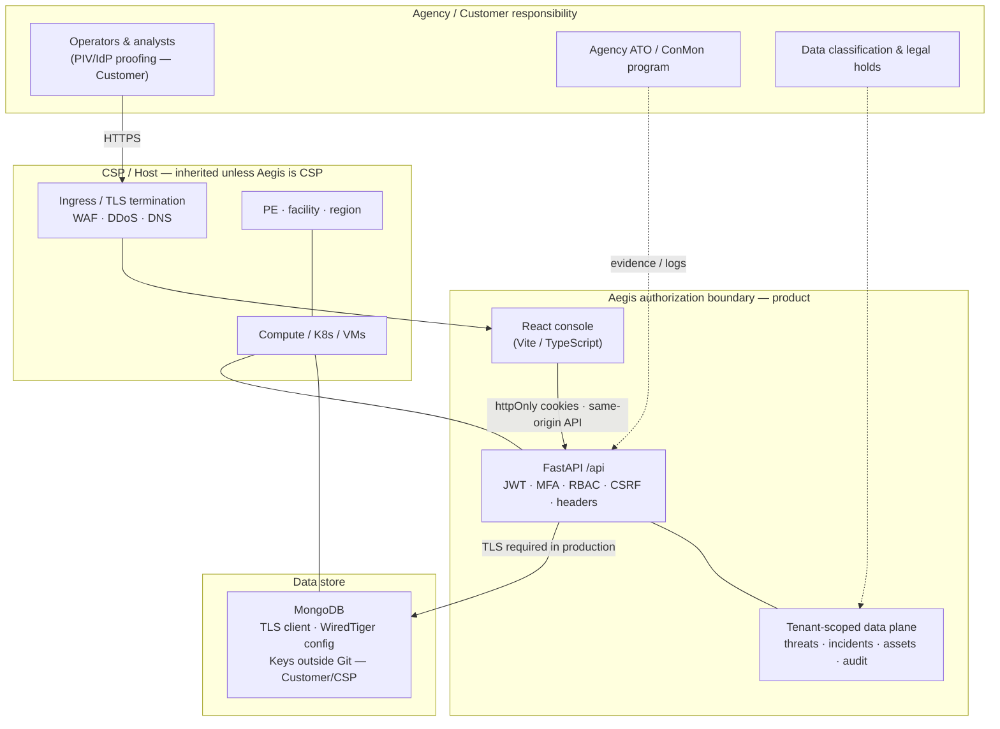
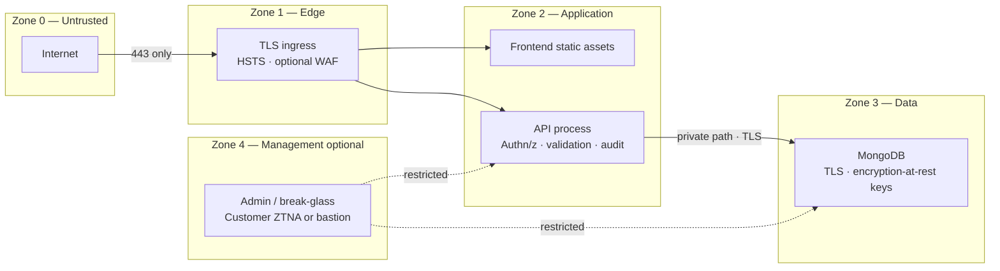
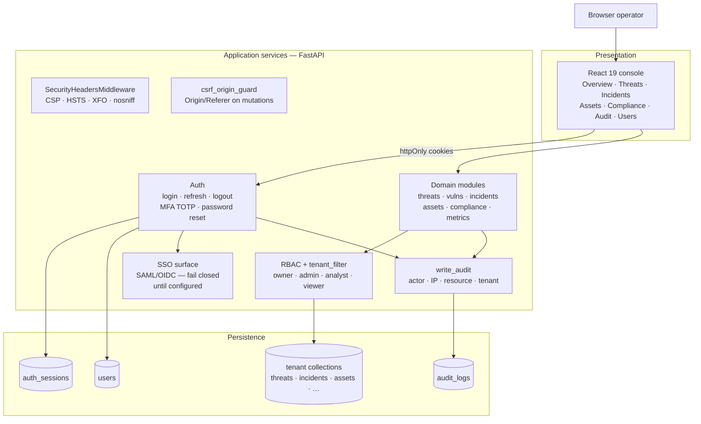
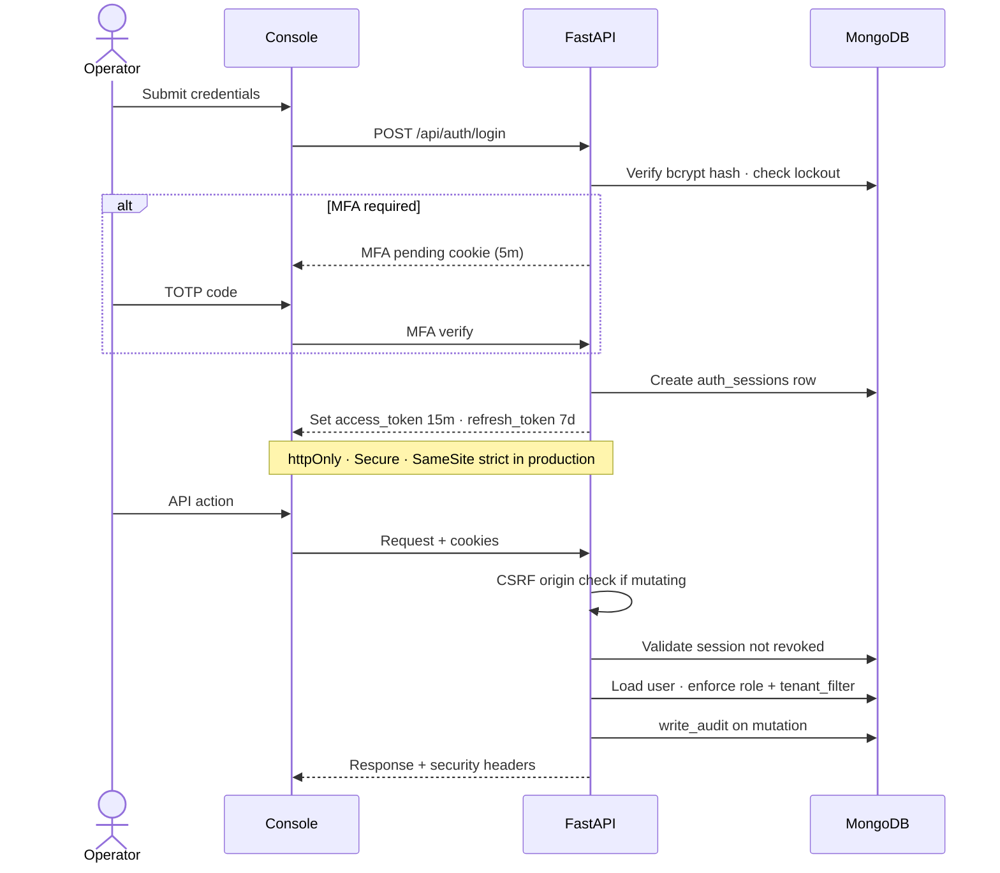
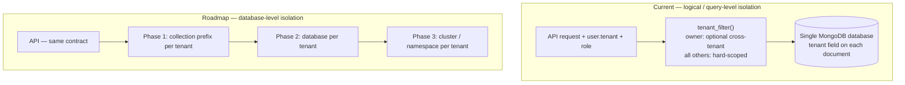
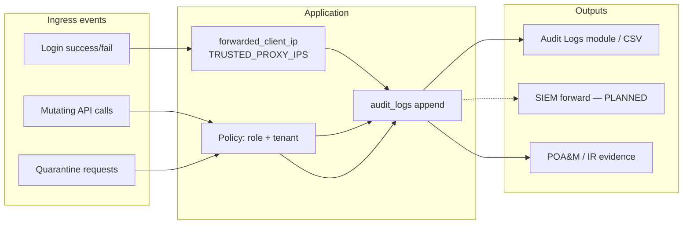
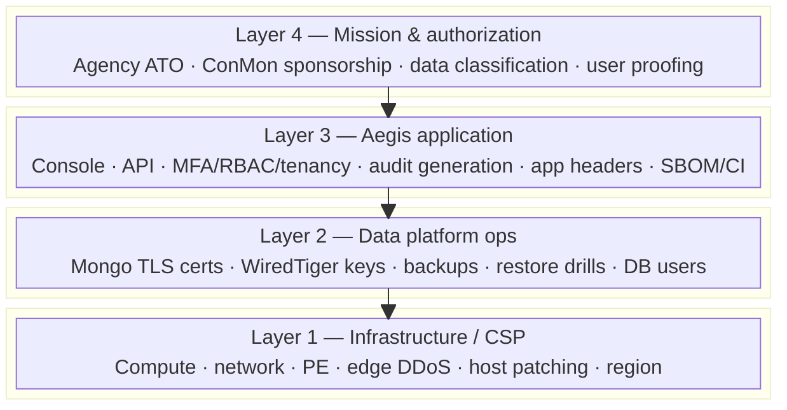
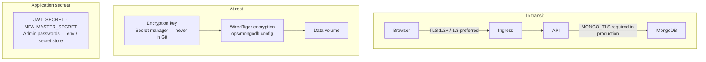
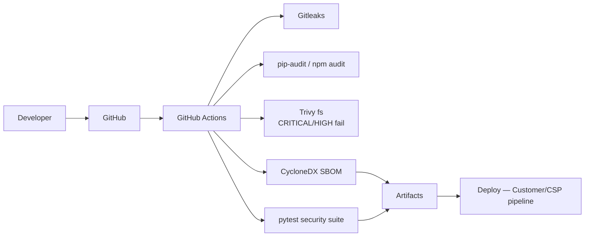
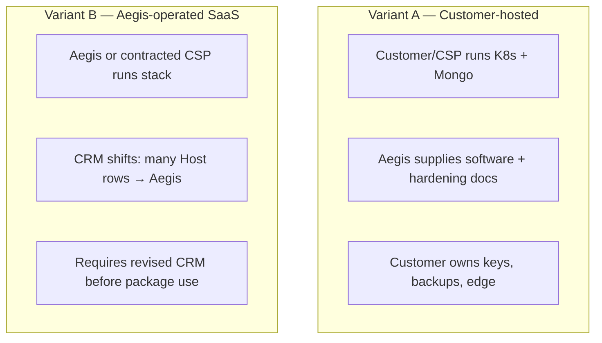

# Aegis SOC — FedRAMP Security Architecture Diagrams

**Document version**: 1.0  
**Platform version**: v2.1.0  
**Aligned to**: `docs/FEDRAMP_MODERATE_BASELINE.md` · `docs/FEDRAMP_CRM_AND_PARAMETERS.md`  
**Owner**: William Brown (`william.brown@aegis-soc.io`)  
**Classification**: UNCLASSIFIED — Shareable under NDA for buyer / investor / contracting diligence

> **Not an SSP diagram package and not evidence of FedRAMP authorization.**  
> These diagrams describe the *intended* Moderate-aligned security architecture for diligence and engineering alignment.

Mermaid diagrams render on GitHub. For slides or print, export from any Mermaid-compatible tool.

---

## 1. Authorization boundary (context)

High-level system context: who sits outside the Aegis product boundary, and what crosses it.

**Boundary statement:** The Aegis product boundary includes the web console, API, application security controls, logical tenant filtering, and application-generated audit events. Physical controls, hypervisor, and edge DDoS are **inherited** from the CSP unless Aegis operates the host under contract (CRM Variant B).

---

## 2. Trust zones

| Zone | Trust | Primary controls |
| --- | --- | --- |
| 0 Untrusted | None | External clients, attackers |
| 1 Edge | Low | TLS 1.2+, HSTS, CSP headers, rate limits (planned), WAF (CSP/Customer) |
| 2 Application | Medium | MFA, JWT sessions, RBAC, tenant filter, CSRF origin guard, Pydantic validation |
| 3 Data | High | Mongo TLS, WiredTiger encryption config, least-privilege DB user (buyer ops) |
| 4 Management | Highest | Not product-default; Customer network isolation for host admin |

---

## 3. Logical component architecture

---

## 4. Authentication & session flow

**Controls illustrated:** AC-7 lockout, IA-2 MFA, AC-12 session binding, SC-23 session authenticity, AU-2 audit generation, AC-3 enforcement.

---

## 5. Multi-tenant data isolation (current vs roadmap)

**FedRAMP note:** Logical isolation is acceptable for many Moderate SaaS patterns when enforced server-side and tested; high-side or high-sensitivity agency deployments should plan Phase 2+ per dossier §5.5.

---

## 6. Data flow — security-relevant events

---

## 7. Shared responsibility layers

| Layer | Primary owner (Variant A: customer-hosted) |
| --- | --- |
| 4 Mission | Customer / Agency |
| 3 Application | **Aegis** |
| 2 Data platform ops | **Customer** (with Aegis config/runbooks) |
| 1 Infrastructure | **CSP / Customer** |

See CRM: `docs/FEDRAMP_CRM_AND_PARAMETERS.md`.

---

## 8. Encryption & key points

**SC-28 honesty:** Shipping `ops/mongodb/` configuration is **not** complete encryption-at-rest until keys are provisioned and restore/decryption is tested by the party operating MongoDB.

---

## 9. CI/CD security supply chain (platform build)

Build-time controls support CM-8, RA-5, SI-2, SR-3/SR-4. Runtime host scanning remains Customer/CSP per CRM.

---

## 10. Deployment variant overlay

---

## 11. Diagram-to-control index

| Diagram § | Primary 800-53 / FedRAMP themes |
| --- | --- |
| 1 Boundary | Authorization boundary, inheritance |
| 2 Trust zones | SC-7, SC-8, AC-17 |
| 3 Components | CM-8 inventory view |
| 4 Auth sequence | IA-2, IA-5, AC-7, AC-12, SC-23, AU-2 |
| 5 Tenancy | AC-3, AC-4, AC-6 |
| 6 Audit flows | AU-2, AU-3, AU-6, CA-7 |
| 7 Shared layers | CRM / PL-2 narrative |
| 8 Encryption | SC-8, SC-12, SC-13, SC-28 |
| 9 CI/CD | RA-5, CM-8, SI-2, SR-3, SR-4 |
| 10 Variants | Deployment model for SSP |

---

## 12. Explicit non-claims

1. Diagrams are **design-target architecture**, not a statement of residual risk acceptance.  
2. No FedRAMP ATO is implied.  
3. CSP boxes are illustrative; real inheritance comes from the CSP’s authorization package.  
4. SSO and PIV paths are shown as surfaces or planned capabilities, not completed federal IdP integrations.

---

## 13. Related documents

| Document | Path |
| --- | --- |
| FedRAMP Moderate baseline | `docs/FEDRAMP_MODERATE_BASELINE.md` |
| CRM & parameters | `docs/FEDRAMP_CRM_AND_PARAMETERS.md` |
| Security dossier | `SECURITY_DOSSIER.md` |
| NIST 800-53 appendix | `NIST_ALIGNMENT.md` |
| Security entry point | `SECURITY.md` |

---

## 14. Revision History

| Version | Date | Change | Author |
| --- | --- | --- | --- |
| 1.0 | 2026-10-04 | Initial FedRAMP security architecture diagrams (boundary, zones, components, auth sequence, tenancy, audit, shared responsibility, encryption, CI/CD, variants). | William Brown / Grok |

---

**William Brown** · Owner & Operator — Aegis SOC  
Email: `william.brown@aegis-soc.io`

© 2026 Aegis SOC · All rights reserved
